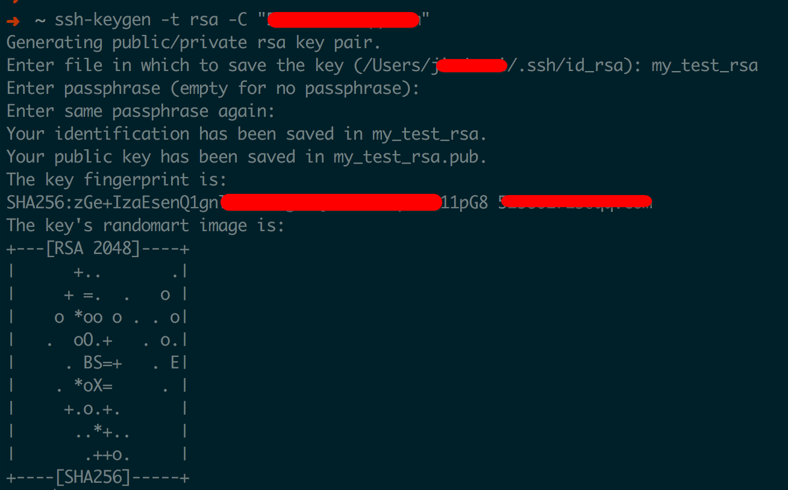
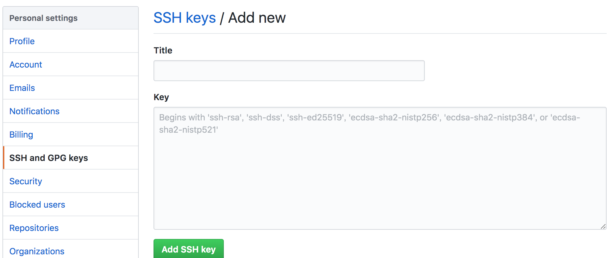

这是我的第一篇文章，主要用来记录Hexo + Github 搭建个人技术博客过程

## Hexo + Github 搭建个人技术博客过程

### 背景
作为一个程序员，一直想搞一个个人的技术博客，虽然有很多技术博客网站（CSDN、简书等）都很好用，但本人主要想用记录博客的方式记录一些技术细节，方便以后好查找。本着免费的原则，网上找了很久，终于发现了Hexo，它可以很简单的使用GitHub托管的方式快速搭建一个博客，下面我记录下本人搭建的过程。

### 前提

准备工作

+ 拥有一个GitHub账号
+ 安装Node.js、npm，并了解相关基础
+ 安装Git客户端

本人使用的环境

+ mac
+ node -v `v8.8.1`
+ git --version `2.12.2`


### 新建仓库

在GitHub新建一个名为`{username}.github.io`的仓库，比如你的GitHub用户名是pig，就新建一个pig.github.io的仓库。将来博客搭建好了之后，就可以通过，`https://pig.github.io`来访问了。


### 配置SSH key

要想提交代码到GitHub，必须有GitHub权限才行。GitHub可以通过配置SSH Key来解决本地跟GitHub服务器的连接安全问题。

1.配置全局name和email

``` bash
git config --global user.name "name"
  
git config --global user.email "email"
```
name和email是注册github的昵称和邮箱

2.生成Key

```
ssh-keygen -t rsa -C "your email"
```

之后会让你输入GitHub账号和密码，输入文件名，默认为id_rsa，路径在~/.ssh/id_rsa


3.设置ssh key

```
cat id_rsa.pub
```

将内容添加到GitHub -> Settings -> SSH and GPG Keys -> New SSH Key


### Node.js、npm、git安装

由于本人是使用的mac
```
brew install node
brew install npm
brew install git
```

### Hexo安装

hexo地址
https://hexo.io/zh-cn/docs/index.html

```
npm install -g hexo-cli
```

hexo的使用请看文档，不再赘述。

### 主题配置

hexo 我选择使用Next主题

> 下载主题

在博客根目录出打开命令行输入以下命令:
```
git clone https://github.com/theme-next/hexo-theme-next themes/next
```
将主题下载到博客的themes/next文件夹下

> 启用主题

只需在_config.yml中增加一行 `theme: next`

> 主题设定

Next主题相关的配置相当灵活，基本在/themes/next/_config.yml文件中，我的相关配置如下

```
Scheme: Mist
sidebar:
  position: right
highlight_theme: night eighties
```

### 开始写文章

在命令行界面，进入博客根目录，输入`hexo new [post] 2018-09-02-my_first.md`就会在`source/_posts`目录下自动创建名为`2018-09-02-my_first.md`的`markdown`文件，然后进行`markdown`编写就行了

### 本地预览

运行`hexo server`命令启动Hexo，使用浏览器访问`http://localhost:4000/`即可浏览博客

### 发布到GitHub

```
deploy:
  type: git
  repo: 你的博客git地址
  branch: master
  message: 
```

在_config.yml中配置GitHub相关项目配置后，运行`hexo deploy`，hexo会将博客生成的静态内容push到GitHub项目下，过一会你通过`https://pig.github.io`就可以在线看到博客内容了