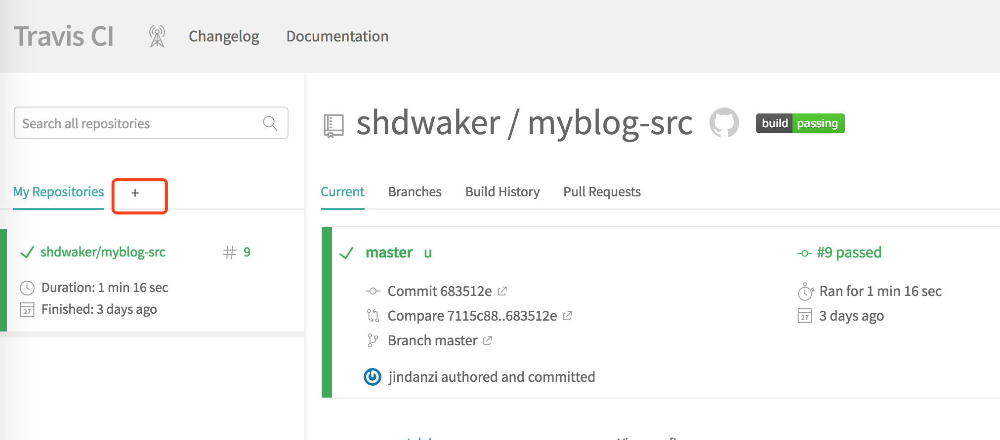
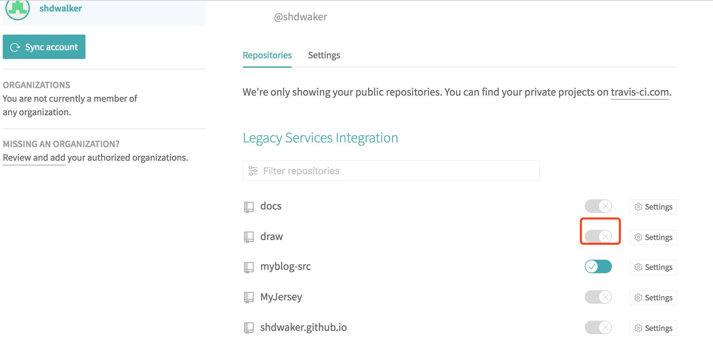
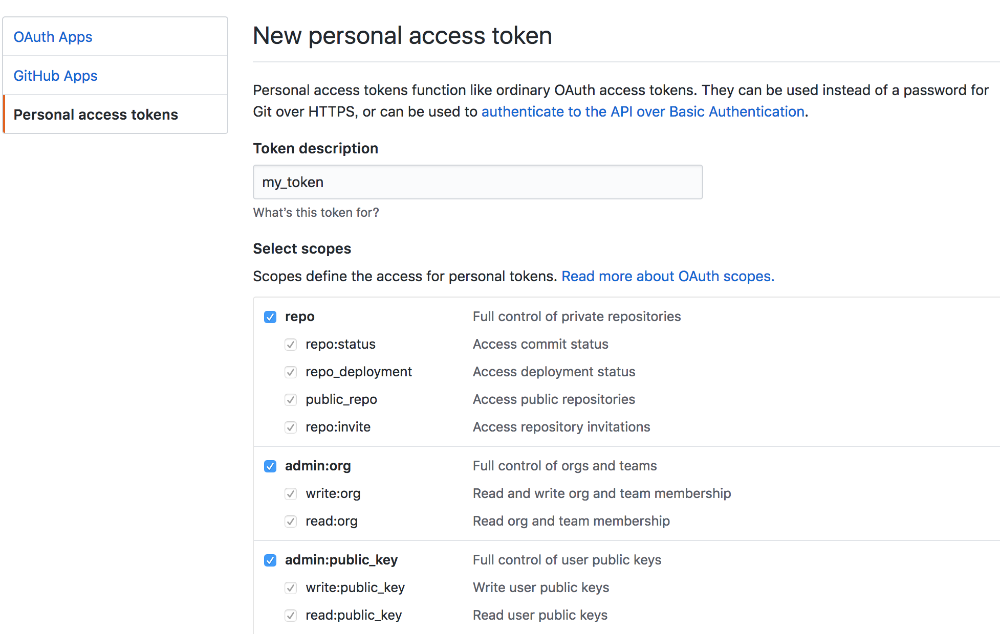
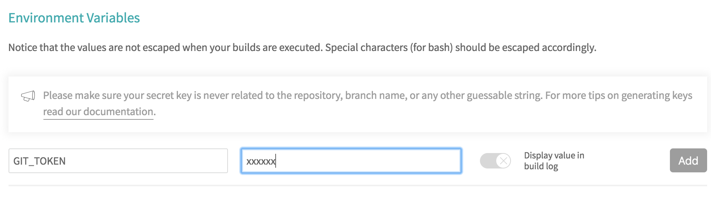

前面介绍了`Hexo`搭建博客的过程，在使用的过程中，`push`到`GitHub`上面的实际上是`hexo`生成的静态文件，源代码依然还在本地。万一源文件丢失或者更换了电脑，怎么更新博客呢，于是想到将源文件也托管到`GitHub`上，但是每次都要`push`两次，有没有一个工具可以自动进行部署呢？
<!-- more -->

## Travis CI介绍

前面提到，我想做到把源代码放到`GitHub`上，只要要源代码提交，能自动将代码编译后上传到`username.github.io`仓库下，既托管了源代码又能自动进行部署，完美！！！这其实就是一个CI的过程，CI是啥，我就不做介绍，自行Google。

Travis CI 是目前新兴的开源持续集成构建项目，它与jenkins，GO的很明显的特别在于采用yaml格式，同时他是在在线的服务，不像jenkins需要你本地打架服务器，简洁清新独树一帜。目前大多数的github项目都已经移入到Travis CI的构建队列中，据说Travis CI每天运行超过4000次完整构建。

项目网址：https://travis-ci.org/

## 配置Travis CI

+ 使用Github账号登录Travis CI，登录之后，点击页面左侧的加号



+ 会列出你的GitHub项目，点击X开启项目



+ 项目配置

配置项都选择默认，我们需要配置的是access token

+ 生成Access Token

到GitHub -> Settings -> Developer settings -> Personal access tokens点击生成一个token，权限都勾选上

请注意一定要把token值复制下来，否则到其他页面就看不到内容了

+ 将token添加到项目的环境变量中



## 配置自动构建脚本

Travis CI是根据项目里面的`.travis.yml`文件来自动构建项目的，配置可以参考官方文档
文档：https://docs.travis-ci.com/user/getting-started/

我的该文件配置如下：
```
# Refrecnes:
# https://zespia.tw/blog/2015/01/21/continuous-deployment-to-github-with-travis/
# https://docs.travis-ci.com/user/languages/javascript-with-nodejs
# https://github.com/iissnan/theme-next-docs/blob/master/.travis.yml
# http://changyuheng.me/2015/when-hexo-static-site-meets-github-pages-and-travis-ci/

language: node_js
node_js: stable

cache:
  directories:
    - node_modules

before_install:
    - export TZ='Asia/Shanghai' # 更改时区

install:
  - npm install

before_script:
  - git submodule update --remote --merge

script:
  - hexo clean  #清除
  - hexo g  #生成

after_script:
  - git clone https://${GIT_PAGE_REF} .deploy_git  # GH_REF是最下面配置的仓库地址
  - cd .deploy_git
  - git checkout master
  - cd ../
  - mv .deploy_git/.git/ ./public/   # 这一步之前的操作是为了保留master分支的提交记录，不然每次git init的话只有1条commit
  - cd ./public
  - git config user.name "github-username"
  - git config user.email "github-email"
  - git add .
  - git commit -m "Travis CI Auto Builder at `date +"%Y-%m-%d %H:%M"`"
  - git push --force --quiet "https://${GH_TOKEN}@${GIT_PAGE_REF}" master:master

branches:
  only:
    - master
env:
 global:
   - GIT_PAGE_REF: github.com/Repositories/{username}.github.io.git

# configure notifications (email, IRC, campfire etc)
# please update this section to your needs!
# https://docs.travis-ci.com/user/notifications/
notifications:
  email:
    - your-email.com
  on_success: change
  on_failure: always


```

将这个文件放在项目的根目录下

## 测试CI

push一个文件到指定分支上，到Travis-CI网站上能看到如下页面


当状态变成`passed`，打开{username}.github.io就能看到文件的变化，是不是很6！！！
